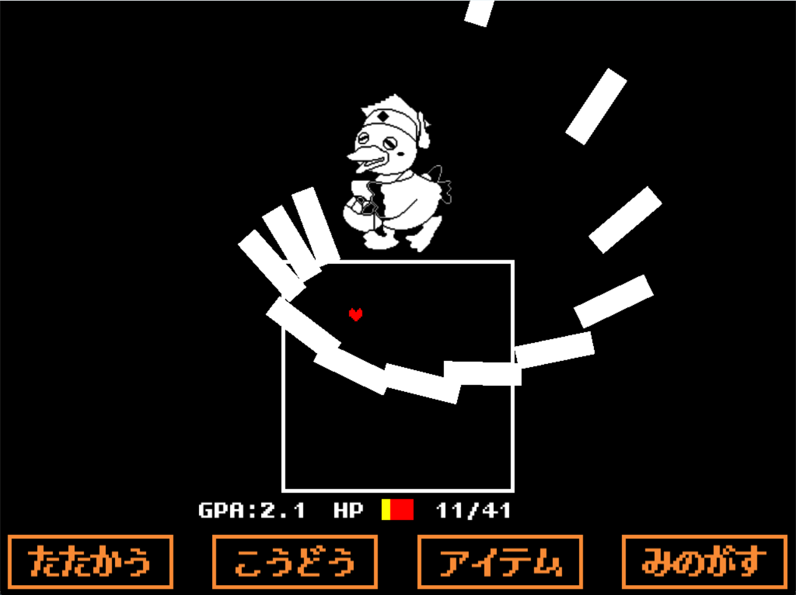

# **KoukaTale**

## 実行環境の必要条件
* python >= 3.10
* pygame >= 2.1

## ゲームの概要
むかしむかし　こうかだいせいと　こうかとんは　たのしい　キャンパスライフをおくっていました。  

こうかとんは　いっしょうけんめい　べんきょうするがくせいたちにひかれて　みんなに　ゆめをとどけていました。

ところが　あるとき　たんいをおとしたがくせいたちが　ゆめをとどけるのをいいこと　こうかとんをじぶんのものにしようと　ひみつのちかけんきゅうしつに　とじこめました。

それから　さらに　ときがながれて......  

かたやなぎけんきゅうとう　ちかけんきゅうしつ  

それは　「はいったら　にどと　もどれない」といわれる　うわさのけんきゅうしつでした。  

あるひ　そこに　ひとりのがくせいが　ゆめをかなえてくれるという　こうかとんのうわさをきいて　やってきました。

はたして　そこにいたのは　ほうんとうにこうかとんなのでしょうか...?  

## ゲームの遊び方
* 基本的には、`ENTERキー`：決定, `ESCキー`：戻る, `矢印キー`：移動や選択 を行う
* プレイヤーは「こうげき」「こうどう」「アイテム」「みのがす」の4つから行動を選ぶ

  |選択|説明|
  |----|----|
  |こうげき|こうかとんを攻撃する|
  |こうどう|こうかとんを〇〇する|
  |アイテム|回復アイテムを使用する|
  |みのがす|こうかとんを逃がす|

* 攻撃されるときは矢印キーでハートを操作し、こうかとんからの攻撃を避ける
* こうかとんのHPが0になるまたは、こうかとんから逃げきれたらゲームクリアとなる
* 自分のHPが0になったらGameOverになる

## ゲームの実装
### 共通基本機能
* ゲームのGUI
* こうかとんの描画とプレイヤーの描画
* ゲームタイトルとゲームオーバーの描画
* こうかとんを倒したときの描画
* 落単攻撃

### 担当追加機能
* ビーム(上下左右から):(担当：田村)
  * beamクラス（上下左右から棒状のビーム攻撃を出すクラス）

* 予告した後にビーム発生:(担当：興)
  * 予告するビームとそこに出てくるビームを出す！

* 画面内玉バウンド:(担当：順)
  * 画面内にいくつかの玉が発生し、バウンドする。

* 追従型攻撃:(担当：杉本)
  1. 追従卵
     * こうかとんの卵をプレイヤーのハートに向かって投げてくる攻撃
     * こうかとんはランダムに移動し大量に投げてくる
  2. 追従ビーム  
     * ハートに向かって追従していくタイプと中心に向かって大量の四角形を生成する攻撃

* 地雷：(担当：石川)
  * 地雷 白色の ◾︎ を Heartの動作範囲に複数配置  
    ↓  
  * 爆発 地雷の配置場所が爆発  
    ↓  
  * 次の地雷 配置  
  * これを攻撃時間終了まで繰り返す。

### ToDo
- [ ] ゲームクリア画面の追加
- [ ] こうかとんに喋らせる

### メモ
* すべてのクラスに関係する関数は，クラスの外でグローバル変数として定義してある
* 画面の切り替えはgameschange, scenechange変数で行う

### ゲームのスクショ
